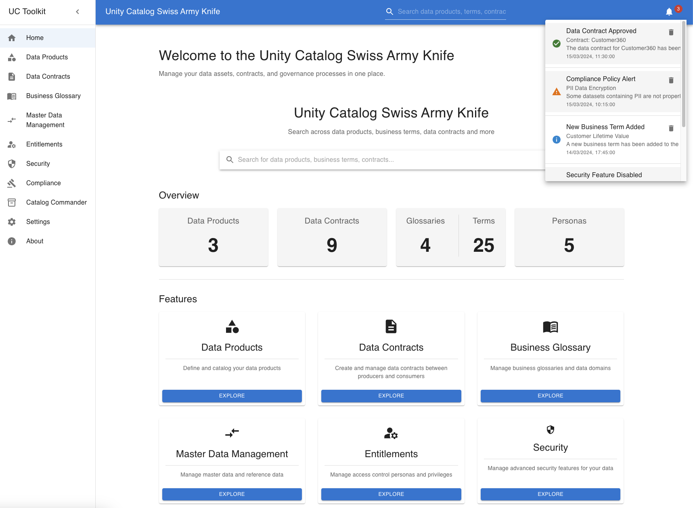

# Unity Catalog Swiss Army Knife

A comprehensive tool for managing Databricks Unity Catalog resources, featuring a React frontend with Tailwind CSS and Shadcn UI, powered by a FastAPI backend.



## Overview

The Unity Catalog Swiss Army Knife provides a unified interface for managing various aspects of Databricks Unity Catalog, including:

- Data Products management
- Data Contracts handling
- Business Glossaries
- Master Data Management
- Advanced Catalog operations

## Architecture

### Frontend (React + TypeScript)

The frontend is built with React, TypeScript, Tailwind CSS, and Shadcn UI, providing a modern and responsive user interface.

Key features:
- Tab-based navigation
- Real-time data synchronization
- Interactive data management interfaces
- Responsive dashboard with summary metrics
- Clean, accessible UI components with Shadcn UI

### Backend (Python + FastAPI)

The backend API is built with FastAPI, providing RESTful endpoints for all data operations.

#### API Endpoints

##### Data Products

# Getting Started

This project uses Vite for the frontend build system and Hatch for the Python backend.

## Available Scripts

In the project directory, you can run:

### `npm run dev`

Runs the app in development mode with Vite.\
Open [http://localhost:3000](http://localhost:3000) to view it in the browser.

The page will reload if you make edits.\
You will also see any lint errors in the console.

### `npm run dev:backend`

Runs the Python-based FastAPI server in development mode.

### `npm run test`

Launches the test runner in the interactive watch mode.

### `npm run build`

Builds the app for production to the `static` folder.\
It correctly bundles React in production mode and optimizes the build for the best performance.

The build is minified and the filenames include the hashes.\
Your app is ready to be deployed!

## Environment Configuration

The application requires a `.env` file in the root directory for configuration. Create a file named `.env` with the following variables:

| Variable | Description | Example Value |
|----------|-------------|---------------|
| DATABRICKS_HOST | Your Databricks workspace URL | https://your-workspace.cloud.databricks.com |
| DATABRICKS_TOKEN | Personal access token for authentication | dapi1234567890abcdef |
| DATABRICKS_HTTP_PATH | SQL warehouse HTTP path | /sql/1.0/warehouses/abc123 |
| DATABRICKS_CATALOG | Default catalog to use | main |
| DATABRICKS_SCHEMA | Default schema to use | default |

# Unified Catalog Application

A modern web application for managing data catalogs, built with FastAPI and React with Tailwind CSS and Shadcn UI.

## Prerequisites

- Python 3.8 or higher
- Node.js 16 or higher
- npm 7 or higher
- Hatch (Python build tool)

## Installation

1. Install Hatch:
```bash
pip install hatch
```

2. Install all dependencies:
```bash
npm run install:all
```

This will:
- Install frontend dependencies using npm
- Create a Python virtual environment using Hatch
- Install backend dependencies in the virtual environment

## Development

To run both frontend and backend servers in development mode:

```bash
npm run dev
```

This will:
- Start the Vite development server on port 3000
- Start the FastAPI development server on port 8000
- Enable hot reloading for both frontend and backend

To run servers separately:

```bash
# Frontend only
npm run dev:frontend

# Backend only
npm run dev:backend
```

## Building for Production

To build both frontend and backend:

```bash
npm run build:all
```

This will:
1. Build the React application with Vite
2. Copy the built files to the FastAPI static directory
3. Build the Python package

To build separately:

```bash
# Frontend only
npm run build:frontend

# Backend only
npm run build:backend
```

## Environment Variables

Create a `.env` file in the root directory with the following variables:

```
DATABRICKS_WAREHOUSE_ID=your_warehouse_id
DATABRICKS_HTTP_PATH=your_http_path
DATABRICKS_CATALOG=your_catalog
DATABRICKS_SCHEMA=your_schema
```

## Project Structure

```
ucapp/
├── api/                    # Backend FastAPI application
│   ├── routes/            # API routes
│   ├── models/            # Data models
│   ├── controller/        # Business logic
│   ├── static/           # Static files (frontend build)
│   └── app.py            # Main application file
├── src/                   # Frontend React application
│   ├── components/       # Reusable UI components
│   ├── views/            # Page components
│   ├── hooks/            # Custom React hooks
│   └── app.tsx           # Main app component
├── public/               # Public assets
├── vite.config.ts        # Vite configuration
├── tailwind.config.js    # Tailwind CSS configuration
├── components.json       # Shadcn UI configuration
├── pyproject.toml        # Hatch configuration
├── package.json          # Frontend dependencies
└── README.md            # This file
```

## Contributing

1. Create a new branch for your feature
2. Make your changes
3. Run tests and linting:
```bash
hatch run test
hatch run lint
```
4. Submit a pull request

## License

This project is licensed under the MIT License - see the LICENSE file for details.
